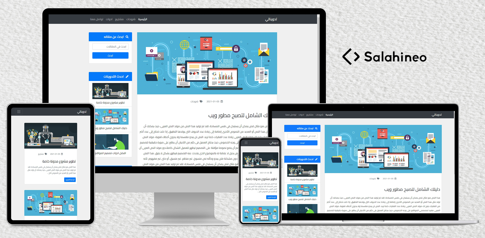

<h1 align="center">Personal Arabic Blog</h1>

## Table of Contents

- [Goal](#goal)
- [Benefits](#benefits)
- [Installation](#installation)
- [Credentials](#credentials)
- [Technologies](#technologies)
- [Contact](#contact)
- [Copyright and license](#copyright-and-license)

### Goal

This is personal blog website. I coded this project to practice on my knowledge of HTML, CSS, JavaScript, jQuery, Bootstrap, PHP, and MySQL in a real project.

> For Front-End design only (HTML - CSS - JavaScript), navigate the Front-End directory in the source code.

### Benefits

Here are some ideas to benefit from this project:

- Take this project as a task and try to make it, and if you could not do a specific section, see how I make it in the source code (use comments to reach this section).
- Extract a code of a specific section and use it in your project.
- Review source code to see how other people code their projects.
- Edit on this project after studying its code well, to know how to work in pair-programming with other people
- Upgrade this project, and add your own sections or pages

### Installation

Here are the guidelines to run this project on your localhost:

1. Download, then install [XAMPP](https://www.apachefriends.org/download.html) web server
2. Download this project, then rename its directory to `personal-blog`
3. Copy the `personal-blog` directory to the `htdocs` directory which exists in XAMPP installation path
4. Start XAMPP control panel from your Desktop, then start `Apache` web server, and `MySQL` server
5. Open your browser, and type `http://localhost/phpmyadmin`, to open PHPMyAdmin home page
6. Create a new database with the name `s_personal_blog`
7. Import the `s_personal_blog.sql` file to this database (This file located in `sql` directory)
8. Open your browser, and type `http://localhost/personal-blog`, to open the home page of the website
9. Navigate to `http://localhost/personal-blog/dashboard`, to open admin dashboard of the website

> You must make a virtual host like `personal-blog.local` for this project, otherwise you will encounter non-accurate routes. If you don't know how to make virtual hosts in XAMPP, then it is the time to search

> Don't forget to edit the `/dashboard/include/connection.php` file with your Database credentials
 
> **Important Note:** The `php.ini` file has a maximum allowed size for uploaded files = 2M, so if you upload a post image more than 2M it will not be uploaded. To avoid this change the `upload_max_filesize`, `max_file_uploads`, and `post_max_size` in the `php.ini` according to this equation: `max_file_uploads * upload_max_filesize = post_max_size`.

### Credentials

If you navigate to `http://localhost/personal-blog/dashboard`, you will be asked for username, and password. Use the credentials below:

- Username: `admin`
- Password: `admin`

> You can change these credentials from the dashboard

### Technologies

- HTML
- CSS
- JavaScript
- jQuery
- Bootstrap
- PHP
- MySQL

> This project is fully responsive

### Contact

- [Github](https://github.com/salahineo) :octocat:
- [LinkedIn](https://linkedin.com/in/salahineo) 💼
- [Facebook](https://facebook.com/salahineo) 😎
- [Twitter](https://twitter.com/salahineo) 🐤
- [Website](https://salahineo.github.io/salahineo/) :globe_with_meridians:
- <a href="mailto:salahineo.work@gmail.com">Email</a> :email:

### Copyright and license

- **[GPLv3](https://www.gnu.org/licenses/gpl-3.0)**
- **© 2021 | Mohamed Salah**

---

**If you find my work good, consider giving it a :star: or fork-ing to show some :heart:. It helps me stay on track and be motivated.**

> **Explore all of my projects from [Here](https://github.com/salahineo/Projects-Reference)**

---
